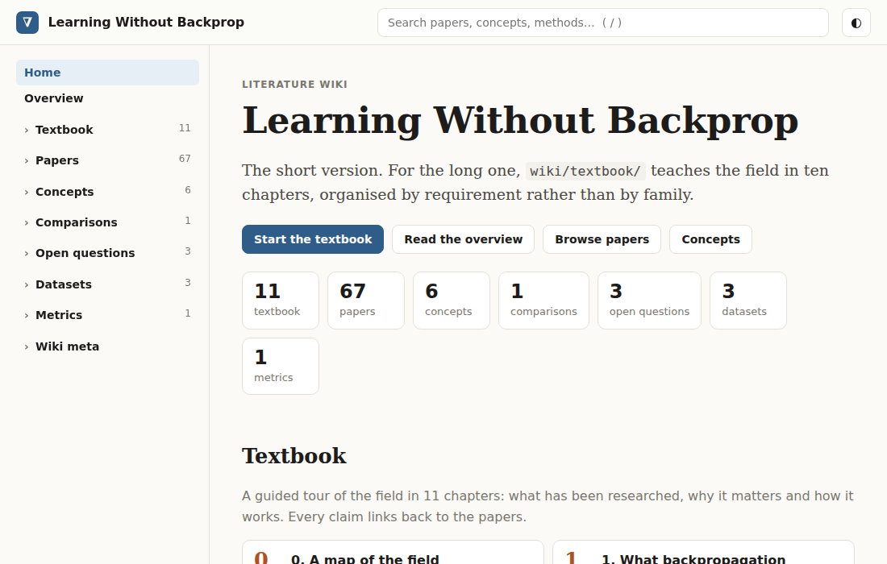
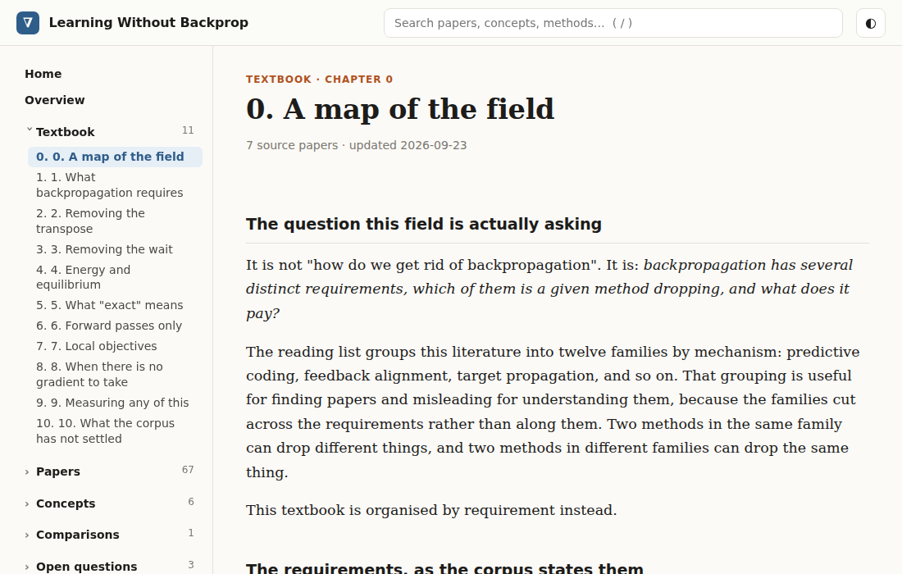
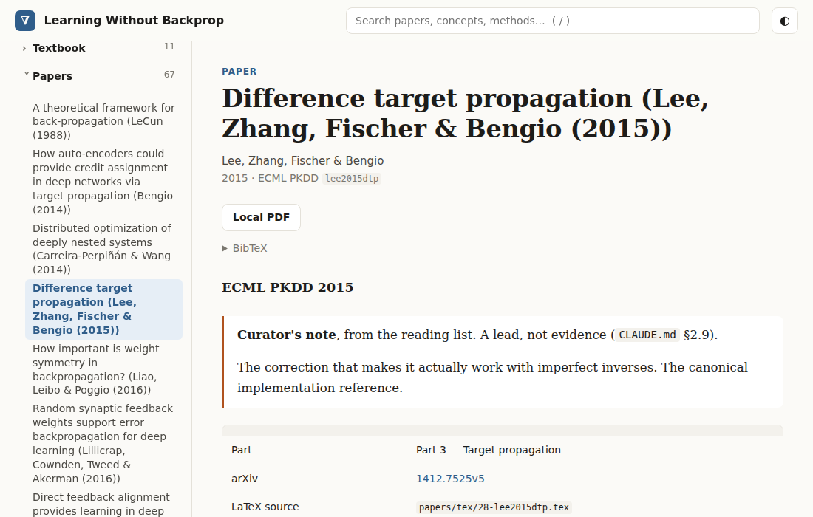
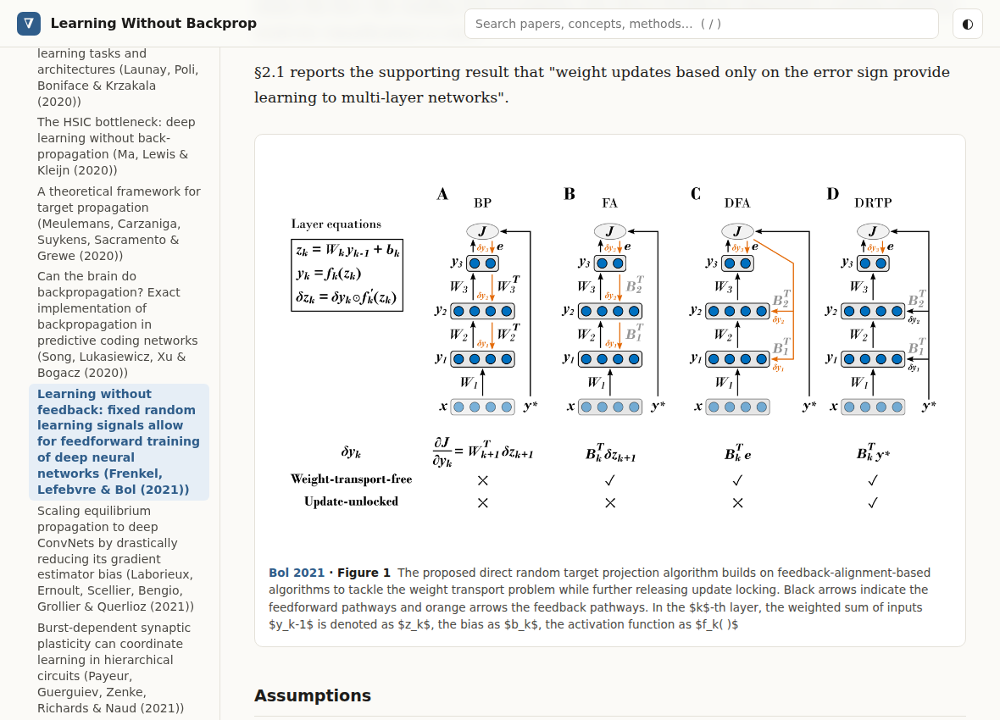

# Literature Wiki skill

An agent skill for building a source-grounded wiki from a curated collection of research papers. It scaffolds the project, helps collect open-access sources, guides paper-by-paper analysis and cross-paper synthesis, checks citations and evidence locators, and builds an offline static site with search and KaTeX math.

The skill lives in [`literature-wiki/`](literature-wiki/SKILL.md). Its `SKILL.md` is the agent entry point; `references/` holds writing guidance, `scripts/` holds the wiki tools, and `templates/` holds the editing contract copied into new projects. It works with Codex and Claude skill directories.

## Example wiki

These screenshots show *Learning Without Backprop*, a literature wiki built with this workflow. Click an image to see it at full size.

<p align="center">
  <a href="docs/images/wiki-home.png"></a><br>
  <sub>Home page · Start with the textbook or browse the paper collection.</sub>
</p>

<p align="center">
  <a href="docs/images/textbook-chapter.png"></a><br>
  <sub>Textbook · A guided introduction to the topic, grounded in source papers.</sub>
</p>

<p align="center">
  <a href="docs/images/paper-page.png"></a><br>
  <sub>Paper page · Source details and navigation into the paper analysis.</sub>
</p>

<p align="center">
  <a href="docs/images/paper-figure.png"></a><br>
  <sub>Paper figures · Original diagrams appear inline with their source and caption.</sub>
</p>

Figure 1 in the last screenshot is from [Frenkel, Lefebvre and Bol (2021)](https://www.frontiersin.org/journals/neuroscience/articles/10.3389/fnins.2021.629892/full), © 2021 the authors, published under [CC BY 4.0](https://creativecommons.org/licenses/by/4.0/). The screenshot shows it within the example wiki.

## Install

Clone the repository, install Python 3.10 or newer, then install the script dependencies:

```bash
git clone https://github.com/Fuminides/literature-wiki-skill.git
cd literature-wiki-skill
python3 -m pip install -r requirements.txt
```

The source and figure tools also use `pdftotext`, `pdfinfo`, and `pdftoppm` from Poppler. `detex` and Ghostscript (`gs`) are optional. Node.js is needed only for the optional math check.

Copy the skill directory into the agent's skill directory:

```bash
mkdir -p ~/.codex/skills
cp -R literature-wiki ~/.codex/skills/
```

For Claude, use `~/.claude/skills/` in the last two commands. You can also use the scripts directly from the cloned repository without installing the agent skill.

## Start a wiki

Give the agent a paper list, the wiki name and topic, and a project directory. For example: “Use the literature-wiki skill to create a wiki about causal discovery from these papers in `./causal-wiki`.” The skill describes each phase and its evidence checks.

To scaffold a project directly:

```bash
python3 literature-wiki/scripts/init_wiki.py ./causal-wiki \
  --name "Causal Discovery" \
  --topic "Methods and evidence for causal discovery from observational data."
cd causal-wiki
python3 .tools/lint_wiki.py
python3 .tools/build_site.py
```

The scaffold creates `papers.csv` for your curated corpus, `wiki/` for the pages, `.tools/` for the scripts and site assets, and both `AGENTS.md` and `CLAUDE.md` with the project's evidence and editing rules. Fill `papers.csv` before the source collection phase. The generated site is in `site/` and can be opened directly from disk.

The scripts contact arXiv or Semantic Scholar only when you run the source discovery and download commands. Download only copies you are allowed to use. The vendored KaTeX files retain their own [MIT license](literature-wiki/scripts/site_assets/katex/LICENSE).

## License

The skill and original tools are available under the [MIT License](LICENSE).
